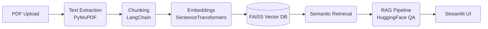

<div align="center">
  
# 🧠 Research Paper Intelligence Engine

**A complete, local, beginner-friendly RAG pipeline for research papers.**

[](https://www.python.org)
[](https://opensource.org/licenses/MIT)
[](http://makeapullrequest.com)

[Features](#-features) • [Installation](#-installation) • [Usage](#-usage) • [Architecture](#-architecture) • [Contributing](#-contributing)

</div>

---

## 📌 Features

Upload one or more research paper PDFs and:
- 💬 **Ask questions** in plain English and get AI-generated answers grounded in the text.
- 📝 **Generate summaries** of any paper automatically.
- 🔍 **Extract insights**: Identify Key Findings, Limitations, and Future Work instantly.
- 📖 **Explore retrieved chunks** for full transparency and citation checking.

**Everything runs entirely locally** — no OpenAI API key needed. Your documents never leave your machine!

---

## 🚀 Quick Start

### Installation

1. **Clone the repository**
   ```bash
   git clone https://github.com/Shshank25/Research-Paper-Intelligence-Engine.git
   cd Research-Paper-Intelligence-Engine
   ```

2. **Create a virtual environment (Recommended)**
   ```bash
   python -m venv venv
   # On Windows
   venv\Scripts\activate
   # On macOS/Linux
   source venv/bin/activate
   ```

3. **Install dependencies**
   ```bash
   pip install -r requirements.txt
   ```

### Usage

1. **Run the Streamlit App**
   ```bash
   streamlit run app.py
   ```
2. **Interact!**
   - Open your browser to `http://localhost:8501`.
   - Drag & drop your PDF(s) into the sidebar.
   - Click **Process & Index PDFs**.
   - Use the interactive tabs to Ask Questions, Summarize, or Extract Insights!

---

## 🏗️ Architecture

This project is built using a state-of-the-art modular RAG (Retrieval-Augmented Generation) pipeline:



### 🤖 Technology Stack

| Component | Technology |
|---|---|
| **PDF Extraction** | PyMuPDF (`fitz`) |
| **Text Splitting** | LangChain `RecursiveCharacterTextSplitter` |
| **Embeddings** | `sentence-transformers` (all-MiniLM-L6-v2) |
| **Vector Store** | FAISS (CPU) |
| **Question Answering** | HuggingFace `deepset/roberta-base-squad2` |
| **Summarization** | HuggingFace `facebook/bart-large-cnn` |
| **Frontend** | Streamlit |

---

## 📁 Repository Structure

```text
Research-Paper-Intelligence-Engine/
├── src/
│   ├── pdf_processor.py       # Extract text from PDFs
│   ├── chunking.py            # Break text into semantic chunks
│   ├── embeddings.py          # Generate vector embeddings
│   ├── vector_db.py           # Manage FAISS index
│   ├── retriever.py           # Perform semantic search
│   ├── rag_pipeline.py        # Execute RAG Q&A
│   └── summarizer.py          # Generate summaries & insights
├── data/                      # Uploaded PDFs (auto-created)
├── documents/                 # Extracted .txt files (auto-created)
├── embeddings/                # Saved .npy embedding arrays
├── vector_store/              # FAISS index + chunk metadata
├── app.py                     # Main Streamlit UI
├── config.py                  # Global configurations
└── run.py                     # App Launcher script
```

---

## ⚙️ Configuration

All tunable parameters can be found and easily modified in `config.py`:

| Parameter | Default | Description |
|---|---|---|
| `CHUNK_SIZE` | `500` | Characters per chunk |
| `CHUNK_OVERLAP` | `100` | Overlap between chunks to retain context |
| `EMBEDDING_MODEL` | `all-MiniLM-L6-v2` | SentenceTransformer model |
| `QA_MODEL` | `deepset/roberta-base-squad2` | Extractive QA model |

---

## 🧪 Testing Modules Independently

You can test each phase independently from the root directory:

```bash
# Phase 1 — PDF Processor
python src/pdf_processor.py path/to/paper.pdf

# Phase 2 — Chunking
python src/chunking.py

# Phase 6 — RAG Pipeline
python src/rag_pipeline.py
```
*(See `src/` for all independent modules.)*

---

## 🤝 Contributing

We welcome contributions! Please see our [Contributing Guidelines](CONTRIBUTING.md) for details on how to submit pull requests, report issues, and suggest features. Please also read our [Code of Conduct](CODE_OF_CONDUCT.md).

---

## 📜 License

This project is licensed under the MIT License - see the [LICENSE](LICENSE) file for details.

---

<div align="center">
  <i>Built with ❤️ as Phase 1 of the Agentic AI Research Scientist system.</i>
</div>
