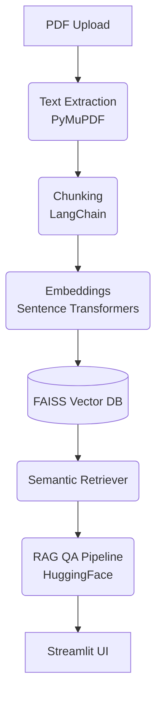

<div align="center">
  
# 🧠 Research Paper Intelligence Engine

**A complete, local, beginner-friendly RAG pipeline for research papers.**

[](https://www.python.org)
[](https://opensource.org/licenses/MIT)
[](http://makeapullrequest.com)

[Overview](#-overview) • [Motivation](#-motivation) • [Features](#-features) • [System Architecture](#-system-architecture) • [Technology Stack](#-technology-stack) • [Installation](#-installation) • [Usage](#-usage) • [Screenshots & Demo](#-screenshots--demo) • [Project Structure](#-project-structure) • [Future Work](#-future-work)

</div>

---

## 📌 Overview

Upload one or more research paper PDFs and use this **Retrieval-Augmented Generation (RAG)** system to ask plain-English questions, generate summaries, and extract insights. 

**Everything runs entirely locally** — no OpenAI API key needed. Your documents never leave your machine!

---

## 💡 Motivation

Reading and synthesizing academic research papers is highly time-consuming. Researchers and students often spend hours parsing through dense PDFs just to extract key methodologies or findings. This project was built to automate the extraction of knowledge, serving as a personal, privacy-first AI Research Assistant that drastically cuts down literature review time.

---

## ✨ Features

- 💬 **Ask questions** in plain English and get AI-generated answers grounded in the text.
- 📝 **Generate summaries** of any paper automatically.
- 🔍 **Extract insights**: Identify Key Findings, Limitations, and Future Work instantly.
- 📖 **Explore retrieved chunks** for full transparency and citation checking.

---

## 🏗️ System Architecture

This project is built using a state-of-the-art modular RAG pipeline:



---

## 🤖 Technology Stack & Versions

We use robust open-source libraries for this local pipeline:

| Component | Technology | Version |
|---|---|---|
| **Language** | Python | `>=3.9` |
| **PDF Extraction** | PyMuPDF (`fitz`) | `1.24.5` |
| **Text Splitting** | LangChain | `0.2.x` |
| **Embeddings** | `sentence-transformers` (all-MiniLM-L6-v2) | `3.0.1` |
| **Vector Store** | FAISS (CPU) | `1.8.0` |
| **QA Model** | HuggingFace `deepset/roberta-base-squad2` | `transformers` |
| **Summarization** | HuggingFace `facebook/bart-large-cnn` | `transformers` |
| **Frontend** | Streamlit | `1.35.0` |

---

## 🚀 Installation

1. **Clone the repository**
   ```bash
   git clone https://github.com/Shshank25/Research-Paper-Intelligence-Engine.git
   cd Research-Paper-Intelligence-Engine
   ```

2. **Create a virtual environment (Recommended)**
   ```bash
   python -m venv venv
   # On Windows
   venv\Scripts\activate
   ```

3. **Install dependencies**
   ```bash
   pip install -r requirements.txt
   ```

---

## 🎯 Usage

1. **Run the Streamlit App**
   ```bash
   streamlit run app.py
   ```
2. **Interact!**
   - Open your browser to `http://localhost:8501`.
   - Drag & drop your PDF(s) into the sidebar.
   - Click **Process & Index PDFs**.
   - Use the interactive tabs to Ask Questions, Summarize, or Extract Insights!

---

## 📸 Screenshots & Demo

### Live Demo


### UI Screenshots
*(Add screenshots of your application here)*
- **Home Interface:** ``
- **PDF Upload:** ``
- **Question Answering:** ``
- **Paper Summary:** ``

---

## 📁 Project Structure

```text
Research-Paper-Intelligence-Engine/
├── src/
│   ├── pdf_processor.py       # Extract text from PDFs
│   ├── chunking.py            # Break text into semantic chunks
│   ├── embeddings.py          # Generate vector embeddings
│   ├── vector_db.py           # Manage FAISS index
│   ├── retriever.py           # Perform semantic search
│   ├── rag_pipeline.py        # Execute RAG Q&A
│   └── summarizer.py          # Generate summaries & insights
├── data/                      # Uploaded PDFs (auto-created)
├── documents/                 # Extracted .txt files (auto-created)
├── embeddings/                # Saved .npy embedding arrays
├── vector_store/              # FAISS index + chunk metadata
├── assets/                    # Demo videos and screenshots
├── app.py                     # Main Streamlit UI
├── config.py                  # Global configurations
└── run.py                     # App Launcher script
```

---

## 🔮 Future Work (Phase 2 & Beyond)

This VT project (Phase 1) successfully established the foundational RAG pipeline. In the next semesters, this project will evolve into a full **Agentic AI Research Scientist**:

- **Multi-Agent Architecture:** Implementing LangGraph or AutoGen to orchestrate multiple specialized agents.
- **Autonomous Paper Discovery:** Integration with the ArXiv API to fetch related papers dynamically.
- **Knowledge Graph Integration:** Mapping relationships between citations and concepts across multiple papers.
- **Research Gap Detection:** Using LLMs to automatically identify unaddressed areas in current literature.
- **Hypothesis & Experiment Generation:** Generating proposals based on detected research gaps.

---

## 📜 License

This project is licensed under the MIT License - see the [LICENSE](LICENSE) file for details.

---

<div align="center">
  <i>Built with ❤️ as a Vocational Training (VT) Project.</i><br>
  <strong>Phase 1 of the Agentic AI Research Scientist system.</strong>
</div>
